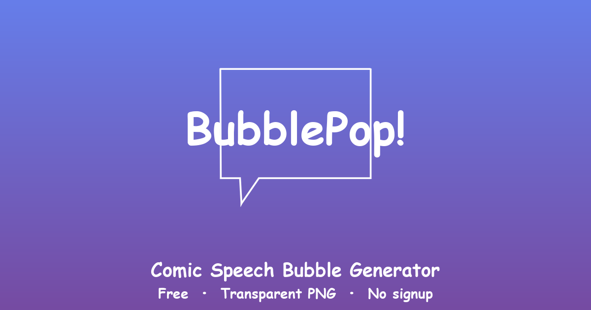

# BubblePop

> Free comic speech bubble generator — transparent PNG, no signup, runs entirely in your browser.

**Live demo** → [getbubblepop.com](https://getbubblepop.com)



## What it does

Pick a bubble style, type your text, hit export. You get a transparent PNG ready to drop into Photoshop, Figma, Canva, Premiere, or any image/video editor.

- 4 comic bubble styles : Speech, Thought, Whisper, Shout
- 5 self-hosted comic fonts : Comic Relief, Bangers, Komika Axis, Architects Hand, Permanent Marker
- Auto-fit text + manual size override (20–400 px)
- 6 quick text colors + custom color picker
- Bold / Italic toggle
- Dark / Light theme with system detection
- Bilingual UI : French / English with browser auto-detection (`?lang=fr|en` supported)
- Undo / Redo with `Ctrl+Z` · `Ctrl+Shift+Z` · `Ctrl+Y`
- Local history of the last 9 bubbles (nothing leaves your device)
- Native share or one-click copy of the URL

## Stack

Pure HTML + CSS + JavaScript vanilla. Zero dependencies, zero build step, single `index.html`. Rendering uses the HTML5 Canvas API.

## Run locally

```bash
git clone https://github.com/inkupappcontact-prog/bubblepop
cd bubblepop
python -m http.server 8000
# open http://localhost:8000
```

Opening `index.html` directly via `file://` works but disables PNG export because of the browser's tainted-canvas restriction. Always serve via a local HTTP server.

## Privacy

No tracking, no cookies, no analytics in the open-source build. The hosted version at `getbubblepop.com` uses Cloudflare Web Analytics (privacy-friendly, no cookies, anonymized). Your bubbles never leave your browser — the last 9 are kept in `localStorage`.

## Support this project

BubblePop is free, ad-free and zero-tracking — and stays that way. If it saved you time, a coffee helps cover hosting and keeps it that way for everyone.

- ☕ [Ko-fi](https://ko-fi.com/getbubblepop) — one-time tip
- 💖 [GitHub Sponsors](https://github.com/sponsors/inkupappcontact-prog) — recurring support

## License

[CC BY-NC 4.0](LICENSE) — free for personal and non-commercial use. Commercial reuse of the codebase is not permitted. Bubbles you create with the tool are yours to use however you like, including commercially.
